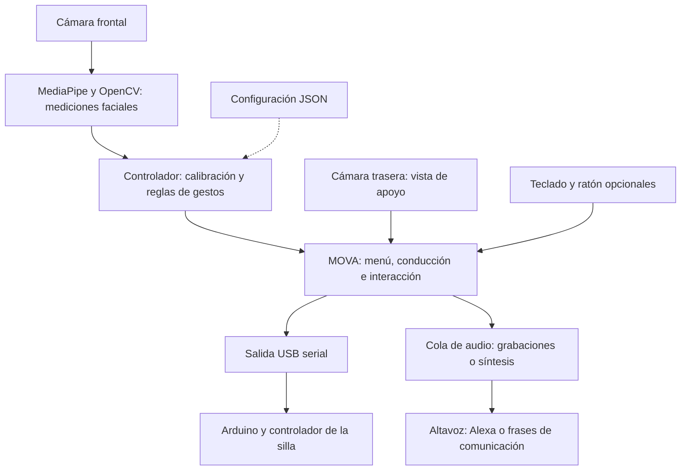

# MOVA · Sillódromo Chair Control

MOVA es una interfaz de control mediante movimientos de cabeza y gestos faciales para el proyecto Sillódromo. Permite seleccionar direcciones de conducción, reproducir órdenes habladas para Alexa y emitir frases de comunicación desde una misma aplicación.

El sistema utiliza una cámara, MediaPipe y reglas geométricas y temporales. **MediaPipe localiza puntos del rostro; el controlador interpreta los gestos; la interfaz decide qué acción ejecutar.**

## Arquitectura general



La visión procesa únicamente la cámara frontal. La cámara trasera aporta una vista de apoyo al retroceder; no se utiliza para detectar obstáculos ni para navegación autónoma. Si ambos índices de cámara coinciden, se comparte la misma captura.

## Cómo funciona la visión

1. **Captura.** OpenCV obtiene la imagen, la refleja horizontalmente y la convierte a RGB. En MOVA, las imágenes de más de 640 píxeles de ancho se reducen conservando sus proporciones.
2. **Puntos faciales.** MediaPipe Face Landmarker carga el modelo preentrenado `face_landmarker.task` y sigue una cara en modo video. Cada imagen lleva una marca de tiempo creciente.
3. **Mediciones.** El código calcula orientación de cabeza, elevación de cejas, cierre de ojos y apertura de boca a partir de los puntos detectados.
4. **Suavizado y calibración.** Se filtran las fluctuaciones de cabeza, cejas y ojos. Después se aprende una referencia de postura central con muestras estables.
5. **Decisión.** El controlador compara las mediciones con umbrales y exige mantener los gestos durante un tiempo mínimo.
6. **Acción.** MOVA interpreta los eventos según la pantalla activa y solicita movimiento o reproducción de audio.

| Señal | Cálculo principal | Uso |
| --- | --- | --- |
| Cabeza | `solvePnP()` estima la orientación a partir de seis correspondencias entre puntos 2D y un modelo 3D | Elegir arriba, abajo, izquierda o derecha |
| Cejas | Separación ceja-ojo normalizada por la distancia entre ojos | Cambiar de página en interacción |
| Ojos | EAR: relación entre apertura vertical y anchura del ojo | Cancelar el gesto si se supera el umbral de cierre |
| Boca | Apertura entre labios dividida entre anchura de boca | Solicitar parada y regresar al menú |

Las direcciones proceden del giro horizontal (*yaw*) y vertical (*pitch*) de la cabeza. **No se rastrea la mirada de las pupilas.** La calibración aprende el centro del usuario, pero no entrena un modelo nuevo ni ajusta automáticamente los umbrales.

## Uso de la interfaz

| Pantalla o gesto | Comportamiento |
| --- | --- |
| Menú: dirección superior sostenida | Entrar a conducción |
| Menú: dirección inferior sostenida | Entrar a interacción |
| Conducción: dirección confirmada | Solicitar movimiento en esa dirección mientras se mantenga |
| Interacción: dirección confirmada | Reproducir el comando asignado al sector |
| Interacción: cejas levantadas sostenidas | Pasar a la siguiente página de comandos |
| Apertura de boca confirmada | Volver al menú y solicitar parada |

Los comandos se agrupan en páginas de cuatro, en este orden: **arriba, derecha, abajo e izquierda**. La interfaz gobierna el modo del controlador según la pantalla activa.

Para confirmar una dirección o las cejas, primero hay que permanecer en el centro y después sostener el gesto. Al abandonar una dirección activa se solicita parada; un nuevo gesto requiere volver al centro. La boca tiene su propio rearme: debe observarse un cierre antes de confirmar otra apertura.

El detector también puede ejecutarse por separado. En ese caso, las cejas alternan sus modos internos de movimiento e interacción, y los eventos se imprimen en terminal; no se controla Arduino ni se reproduce audio.

## Decisiones técnicas

| Decisión | Motivo y compromiso |
| --- | --- |
| Modelo facial preentrenado y reglas explícitas | Permite ajustar sensibilidad y tiempos sin entrenar un clasificador de comandos propio. Las reglas deben adaptarse a la persona y al entorno. |
| Puntos de pose menos afectados por la mandíbula | Nariz, entrecejo, esquinas externas de ojos y sienes reducen la interferencia de abrir la boca sobre la orientación estimada. |
| Distancias normalizadas | Dividir por el ancho de boca o la separación entre ojos reduce la dependencia del tamaño aparente del rostro. La perspectiva todavía influye. |
| Referencia individual de reposo | La calibración usa medianas y rechaza muestras inestables, permitiendo una postura central cómoda. |
| Filtro de media móvil exponencial | Reduce el temblor de las mediciones a cambio de retraso. Un `smooth-alpha` menor suaviza más; un valor de `1` desactiva ese suavizado. |
| Umbrales de entrada y salida distintos | La histéresis evita alternar continuamente entre movimiento y parada cerca del límite de activación. |
| Confirmación temporal y retorno al centro | Reduce activaciones por movimientos breves y evita repetir una selección mientras se mantiene el gesto. |
| Captura, visión, audio y escritura serial en hilos separados | Mantiene la interfaz disponible durante procesamiento y reproducción. La cámara publica solo el fotograma más reciente para evitar acumular imágenes atrasadas. |
| Eventos con tiempo y generación de pantalla | Permite descartar órdenes antiguas o correspondientes a una pantalla anterior. |
| CPU por defecto y GPU opcional | Facilita la ejecución sin aceleración específica. Si falla la creación del detector con GPU, se intenta usar CPU. |

La lógica de gestos está separada de la cámara y del hardware, por lo que puede revisarse y probarse usando mediciones numéricas sin abrir un dispositivo.

## Audio y Alexa

`control_alexa.py` procesa una cola de audio independiente. Los comandos se definen en `alexa_commands` dentro de `gesture_config.json`.

- `phrase`: texto del comando o mensaje; también sirve como respaldo para síntesis.
- `audio`: grabación de la orden o de la frase completa.
- `wake_audio`: grabación de la palabra «Alexa». Si se configura, se reproduce antes de `audio`, que debe contener solo la orden.
- `rate` y `volume`: velocidad de síntesis y volumen de salida. `rate` no cambia la velocidad de las grabaciones.
- `pause_before`, `pause_after_wake` y `pause_after`: pausas antes, entre activación y orden, y después del comando.

Las grabaciones se reproducen con `ffplay`; los formatos disponibles dependen de esa instalación. El perfil actual contiene rutas `.m4a.mp4` y `.mp4`. Las rutas relativas se resuelven desde la carpeta del proyecto.

Si falta la grabación principal, se sintetiza `phrase` con `pyttsx3`. Si existe la orden pero falta el `wake_audio` configurado, se sintetiza «Alexa». Un archivo existente que no pueda reproducirse genera un error; ese fallo no activa automáticamente la síntesis.

Alexa recibe el sonido por su micrófono: no hay una integración directa con su API ni confirmación de que haya ejecutado la orden. Las frases de comunicación pueden usar `wake_audio` vacío.

## Archivos principales

| Archivo | Responsabilidad |
| --- | --- |
| [`mova.py`](mova.py) | Interfaz, cámaras, procesamiento en segundo plano y destino de los eventos |
| [`gestures/mediapipe_gestures.py`](gestures/mediapipe_gestures.py) | Modelo facial, geometría, suavizado y vista previa del detector |
| [`gestures/gesture_controller.py`](gestures/gesture_controller.py) | Calibración, umbrales, tiempos y eventos de gestos |
| [`gestures/config.py`](gestures/config.py) | Valores de respaldo, validación y persistencia de configuración |
| [`gesture_config.json`](gesture_config.json) | Perfil de gestos, cámaras y comandos de audio |
| [`arduino_output.py`](arduino_output.py) | Escritura serial, caducidad de órdenes y envío de neutro |
| [`control_alexa.py`](control_alexa.py) | Cola, síntesis, reproducción y pausas de audio |

El modelo se carga desde `models/face_landmarker.task` por defecto y se descarga si falta. La ruta activa de visión importa `GestureController` desde su módulo independiente; no ejecuta OpenFace.

## Configuración y ejecución

Se requiere un entorno Python compatible con MediaPipe, OpenCV, NumPy, Pillow, pyserial y Tkinter. La síntesis utiliza `pyttsx3` y las voces del sistema; las grabaciones requieren `ffplay` disponible en `PATH`.

Desde la raíz del repositorio, usando el entorno virtual del proyecto:

```bash
# Interfaz principal
./.venv/bin/python mova.py

# Interfaz con controles manuales de teclado y ratón
./.venv/bin/python mova.py --manual

# Vista previa de gestos, sin salida hacia Arduino ni Alexa
./.venv/bin/python gestures/mediapipe_gestures.py --preview --debug
```

En modo manual se utilizan WASD o flechas; `Esc` regresa al menú. `F11` alterna pantalla completa. Los índices de cámara y el puerto USB deben corresponder a los dispositivos conectados.

El perfil `profiles.mediapipe` del JSON tiene prioridad sobre los valores de respaldo. Los argumentos explícitos de terminal pueden sobrescribir sus parámetros correspondientes.

| Parámetros | Qué ajustan |
| --- | --- |
| `threshold_x`, `threshold_y`, `release` | Ángulos necesarios para seleccionar dirección y volver al centro; en radianes |
| `hold`, `center_hold`, `calibration` | Duración de gesto, rearme central y calibración; en segundos |
| `diagonal_ratio`, `sustain_ratio` | Predominio requerido de un eje para iniciar o sostener una dirección |
| `brow`, `blink` | Umbrales de cejas y cierre de ojos, en las escalas geométricas del código |
| `mouth_open`, `mouth_close`, `mouth_hold`, `mouth_close_hold` | Umbrales y tiempos de apertura y rearme de boca |
| `menu_hold`, `interact_page_hold` | Tiempos para elegir pantalla y cambiar página |
| `invert_x`, `invert_y` | Inversión de los ejes de dirección |
| `cam_front_index`, `cam_rear_index` | Dispositivos de captura |

## Salida de movimiento y alcance

La salida serial transmite dos bytes, **vertical y horizontal**, a **9600 baudios**. El código actual usa `(128, 128)` como neutro y amplitud fija de `120` respecto a ese centro. El ángulo de cabeza selecciona una dirección; no regula proporcionalmente la velocidad.

Se solicita parada al perder seguimiento, superar el umbral de cierre de ojos, abandonar una dirección activa, abrir la boca o cambiar de pantalla. Las órdenes también tienen caducidad. El adaptador de MOVA puede volver a habilitar la salida cuando recibe una nueva orden válida en conducción.

**El protocolo y el neutro deben coincidir con el firmware y el controlador conectados.** La aplicación no recibe confirmación física del movimiento o de la parada. La estimación de pose utiliza un modelo facial fijo y una cámara aproximada; iluminación, oclusiones, perspectiva y diferencias entre usuarios afectan las mediciones.
