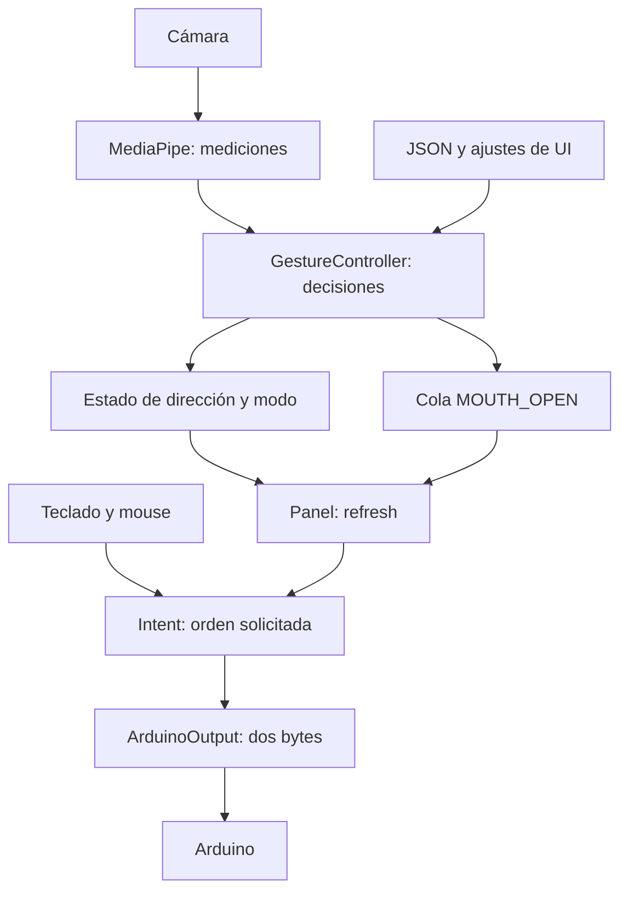
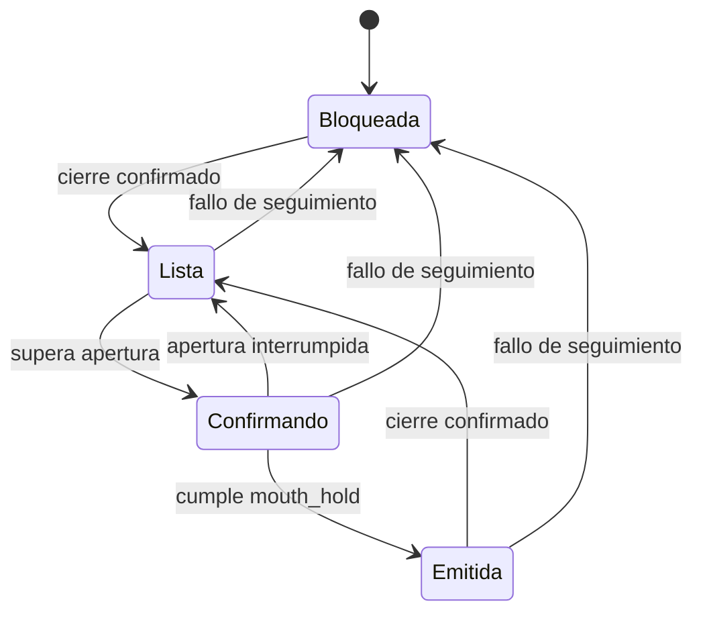

# Sillódromo Chair Control · MOVA

Interfaz de control manual y facial para el proyecto Sillódromo. MOVA transforma entradas de teclado, mouse o gestos en una intención de dirección y la envía por USB serial a un Arduino. Incluye calibración facial, ajustes persistentes y detección de apertura de boca.

> La salida del programa representa una orden solicitada. El software no recibe confirmación de movimiento o parada de la silla. El protocolo actual supone dos bytes y neutro `(128, 128)`; esto debe corresponder al firmware y al controlador realmente conectados.

## Contenido

1. [Inicio y uso](#inicio-y-uso)
2. [Mapa del repositorio](#mapa-del-repositorio)
3. [Arquitectura](#arquitectura)
4. [Qué mide MediaPipe](#qué-mide-mediapipe)
5. [Calibración y controlador de gestos](#calibración-y-controlador-de-gestos)
6. [Sensibilidad, diagonales e histéresis](#sensibilidad-diagonales-e-histéresis)
7. [Apertura de boca](#apertura-de-boca)
8. [Configuración y ajustes](#configuración-y-ajustes)
9. [UI, concurrencia y salida serial](#ui-concurrencia-y-salida-serial)
10. [OpenFace y Alexa](#openface-y-alexa)
11. [Pruebas y diagnóstico](#pruebas-y-diagnóstico)
12. [Cómo estudiar y extender el código](#cómo-estudiar-y-extender-el-código)

## Inicio y uso

### Entorno

Desde un entorno que ya funciona, ejecuta directamente su intérprete:

```bash
cd ~/sillodromo-chair-control
./.venv/bin/python mova.py
```

Esto evita depender de qué `python` resuelve el shell. Si renombraste la carpeta del proyecto, los scripts de activación de un entorno virtual existente pueden conservar rutas anteriores; comprobar `sys.executable` permite distinguir ese problema de un import incorrecto:

```bash
./.venv/bin/python -c 'import sys; print(sys.executable)'
./.venv/bin/python -c 'import cv2, mediapipe, numpy, PIL, serial, tkinter; print("Imports disponibles")'
```

Las dependencias se identifican por los imports actuales; el repositorio revisado no contiene un `requirements.txt` ni versiones fijadas.

| Componente | Dependencias |
|---|---|
| UI principal | Python, Tkinter/ttk, Pillow |
| Detector MediaPipe | MediaPipe Tasks, OpenCV, NumPy |
| Salida USB | pyserial |
| Detector OpenFace alternativo | Ejecutable `FeatureExtraction` compilado; el puente Python utiliza biblioteca estándar |
| Aplicación Alexa independiente | pygame y pyttsx3; síntesis depende de las voces del sistema |
| Scripts manuales anteriores | pyserial y pynput |

El código utiliza características de Python 3.9 o posterior; la versión elegida también debe ser compatible con las dependencias instaladas. Tkinter requiere soporte de Tk en la instalación de Python. No reinstales OpenCV sobre una compilación que ya funciona solamente para seguir este README.

### Probar gestos sin enviar órdenes

En MOVA puedes iniciar cámara, calibrar y ver eventos de boca manteniendo el control pausado. No hace falta activar la salida USB para observar el detector.

También puedes ejecutar MediaPipe de forma independiente:

```bash
./.venv/bin/python gestures/mediapipe_gestures.py --preview --debug
```

Este comando muestra la cámara y escribe eventos JSONL en terminal. Por sí solo no abre el puerto serial ni ejecuta Alexa. `Ctrl+C` termina el proceso; con la vista previa activa también puedes usar `Esc`.

### Recorrido de uso en MOVA

1. Inicia la cámara y adopta una postura cómoda, con cejas relajadas y ojos abiertos.
2. Espera la calibración y permanece un momento en el centro.
3. Abre **Ajustes de gestos** si necesitas modificar umbrales; aplicar ajustes reinicia la calibración.
4. Para transmitir, selecciona el puerto correcto, conecta el Arduino y elige la fuente **Manual** o **Gestos**.
5. Pulsa **Activar control**. En Gestos esto vuelve a crear el controlador, calibra y arranca en `INTERACCION`.
6. Mantén el centro, eleva las cejas durante el tiempo configurado para pasar a `MOVIMIENTO`, vuelve al centro y sostén una dirección.
7. Usa **DETENER / Esc** para pausar la salida. La reactivación exige pulsar nuevamente Activar control.

El valor inicial del campo de puerto en la UI es una ruta de macOS. En Linux usa **Buscar puertos** o escribe el dispositivo que corresponda; no presupongas que ese valor inicial identifica tu Arduino.

## Mapa del repositorio

| Ruta | Responsabilidad actual |
|---|---|
| [`mova.py`](mova.py) | Punto de entrada principal; clases `Intent`, `Camera` y `Panel` |
| [`arduino_output.py`](arduino_output.py) | Hilo único de escritura serial, caducidad de órdenes y parada enclavada |
| [`gestures/mediapipe_gestures.py`](gestures/mediapipe_gestures.py) | Cámara, landmarks, métricas faciales, pose y visualización |
| [`gestures/openface.py`](gestures/openface.py) | Clase compartida `GestureController` y programa alternativo que ejecuta OpenFace |
| [`gestures/config.py`](gestures/config.py) | Valores iniciales, validación, lectura y escritura JSON, argumentos de terminal |
| [`gesture_config.json`](gesture_config.json) | Perfiles persistentes de MediaPipe y OpenFace |
| [`models/face_landmarker.task`](models/face_landmarker.task) | Modelo que carga MOVA desde la raíz del proyecto |
| `gestures/models/face_landmarker.task` | Otra copia del modelo; no es la ruta elegida por MOVA |
| [`docs/gestos.md`](docs/gestos.md) | Guía complementaria de los cambios de gestos; sus valores iniciales no sustituyen al JSON actual |
| [`tests/test_gestures.py`](tests/test_gestures.py) | Pruebas de decisiones y configuración sin cámara |
| [`test_serial.py`](test_serial.py) | Pruebas de salida USB con un objeto serial simulado |
| [`test_control.py`](test_control.py) | Pruebas anteriores de intención y controlador; tienen un import que requiere atención |
| [`control_alexa.py`](control_alexa.py) | Aplicación separada para reproducir órdenes habladas |
| [`movement.py`](movement.py), [`moveer.py`](moveer.py) | Control manual alternativo; no forman parte del recorrido de MOVA |
| `OpenFace/` | Submódulo del proyecto OpenFace; no se ejecuta al iniciar MediaPipe |
| [`gestures/gesture_controller.py`](gestures/gesture_controller.py) | Copia separada anterior de la clase; no es la importada por MediaPipe |
| `archivos/` | Copias del paquete de actualización, no archivos activos de la aplicación principal |

**Dónde editar:** la clase activa está en `gestures/openface.py`. La copia `gestures/gesture_controller.py` no incluye la lógica nueva de boca y usa nombres como `json`, `time`, `math`, `statistics` y `log` sin definirlos en ese módulo. No basta con cambiar el import hacia ella.

## Arquitectura



Son tres niveles distintos:

- **Medir:** ¿qué valores tienen ahora la cabeza, las cejas y la boca?
- **Decidir:** ¿la medición cumple las condiciones y se sostuvo suficiente tiempo?
- **Actuar:** ¿el control está habilitado y la orden sigue vigente para enviarla?

Una cara reconocida no implica una orden de movimiento. Un gesto reconocido tampoco implica que el control USB esté activado.

MOVA importa MediaPipe, que a su vez importa `GestureController` desde `openface.py`. El bloque `if __name__ == '__main__'` de OpenFace no se ejecuta durante ese import; por tanto, no arranca `FeatureExtraction` ni un segundo detector.

## Qué mide MediaPipe

### Imagen y landmarks

La aplicación abre la cámara, refleja horizontalmente la imagen y convierte BGR a RGB. MOVA reduce el ancho a 640 píxeles si la imagen es mayor, conservando proporciones. El programa MediaPipe independiente no hace esa reducción.

`FaceLandmarker` se configura en modo `VIDEO` y para una cara. A cada imagen se le asigna un timestamp creciente en milisegundos. El código aumenta al menos una unidad el timestamp para evitar repeticiones cuando dos iteraciones ocurren muy cerca.

Las coordenadas de landmarks se convierten a píxeles multiplicando `x` por el ancho y `y` por el alto. El programa deriva sus métricas con geometría; no configura una clasificación de gestos entrenada a medida ni utiliza blendshapes para boca o cejas.

### Cabeza: `head_pose()`

`POSE_LANDMARKS` contiene seis puntos: punta de nariz, mentón, esquinas exteriores de ojos y comisuras de boca. El programa los empareja con un modelo facial 3D fijo.

`cv2.solvePnP()` busca una rotación y traslación que hagan compatible ese modelo con los puntos observados. `Rodrigues()` convierte la representación de rotación y `decomposeProjectionMatrix()` permite obtener ángulos. La función devuelve:

```python
yaw_rad, pitch_rad
```

- `yaw` representa el giro horizontal y se usa como `x`.
- `pitch` representa la inclinación vertical y se usa como `y`.
- `roll` no se utiliza para seleccionar direcciones.

La matriz de cámara toma la distancia focal como el ancho de la imagen, coloca el centro óptico en el centro de la imagen y supone distorsión nula. Es una aproximación; estos ángulos no equivalen a una medición metrológica de cabeza con cámara calibrada.

**Limitación observada al abrir la boca:** mentón y comisuras se desplazan al articular la mandíbula. El modelo de pose trata esos puntos como parte de una geometría rígida; por ello puede atribuir parte de la deformación facial a una inclinación de cabeza. Esta es una explicación plausible del movimiento vertical del indicador al abrir la boca, pendiente de comprobar con mediciones del usuario.

La apertura no modifica `baseline` en `feed()`: si el punto regresa al cerrar, eso apunta a una distorsión transitoria de pose, no a que se haya aprendido un centro nuevo. Comparar `y` antes, durante y después de abrir permite distinguir ambos casos. Si persiste al cerrar, hay que revisar las mediciones antes de atribuirlo a esta causa.

Una mejora futura sería estimar pose con puntos menos afectados por la mandíbula o evaluar otra representación de transformación facial. Cambiar puntos exige correspondencias 2D/3D coherentes y validar signos, estabilidad y amplitud; reducir el umbral no corrige esta causa. Esa mejora no está implementada en la versión documentada.

### Cejas: `brow_metric()`

Para cada lado se calcula la separación vertical entre ceja y parte superior del ojo, dividida entre distancia interocular. Se promedian ambos lados y se multiplica por `BROW_SCALE = 20`:

```python
separacion = max(0, (y_ojo - y_ceja) / distancia_interocular)
brow = promedio_de_ambos_lados * 20
```

La división reduce la dependencia del tamaño aparente de la cara, pero no elimina cambios por perspectiva, inclinación o expresión. El controlador resta el valor basal de cejas antes de compararlo con `brow` de configuración. La decisión utiliza la elevación respecto al reposo, no la distancia absoluta.

### Ojos: `ear()` y `blink_metric()`

EAR compara apertura vertical y anchura horizontal de cada ojo:

```python
EAR = (distancia_vertical_1 + distancia_vertical_2) / (2 * anchura)
blink = max(0, 0.30 - promedio_EAR) * 12
```

Al cerrarse los ojos, EAR disminuye y `blink` aumenta. Si `blink > a.blink`, el controlador cancela el gesto. El valor `0.30` es una constante del script: no se aprende durante la calibración.

Con `blink=1.8` como umbral, la condición de bloqueo equivale a EAR promedio menor que `0.15`, bajo esta fórmula. Esta métrica no representa una probabilidad ni una unidad de acción de OpenFace.

### Boca: `mouth_metric()`

```python
mouth = distancia(labio_13, labio_14) / distancia(comisura_61, comisura_291)
```

Es una proporción sin unidades. Por ejemplo, apertura interior de 18 píxeles y ancho de 60 producen `mouth=0.30`. Si ambas distancias se duplicaran por igual, la proporción seguiría igual. La perspectiva y los cambios de ancho al gesticular sí pueden afectarla.

Si el ancho no es positivo, devuelve `NaN`; el controlador lo rechaza como medición no confiable.

## Calibración y controlador de gestos

### Interfaz de entrada

```python
controller.feed(x, y, brow, blink, valid, now, mouth=mouth)
```

`now` utiliza un reloj monotónico. Permite calcular duraciones sin depender de la hora del calendario. `mouth` es opcional para conservar compatibilidad con consumidores anteriores; los dos detectores actuales lo proporcionan.

### Variables que conviene entender

| Atributo | Qué representa |
|---|---|
| `baseline` | Medianas de cabeza horizontal, vertical y cejas en reposo |
| `mode` | `INTERACCION` o `MOVIMIENTO` |
| `candidate` | Clasificación actual: centro, dirección, modo, boca o ambiguo |
| `since` | Momento en que comenzó el candidato actual |
| `armed` | Permiso para consumir un nuevo gesto de dirección o cejas |
| `active` | Dirección ya confirmada y sostenida en modo movimiento |
| `last` | Hora de la última llamada a `feed()` |
| `last_fault` | Motivo del último fallo |
| `mouth_ready` | Permiso independiente para una apertura de boca |
| `mouth_since` | Inicio de apertura continua por encima del umbral |
| `mouth_closed_since` | Inicio de cierre continuo por debajo del umbral |

`candidate='DERECHA'` no significa todavía `active='DERECHA'`: falta comprobar permiso y duración.

### Cómo aprende el centro

Mientras `baseline` sea `None`, se almacenan muestras válidas. Se exige:

- Tiempo transcurrido de al menos `calibration`.
- Al menos 15 muestras.
- Desviación estándar poblacional de ambos ángulos suficientemente pequeña.

La comprobación de estabilidad es:

```python
max(pstdev(xs), pstdev(ys)) <= min(threshold_x, threshold_y) / 3
```

Si falla, se vacía la colección y se intenta de nuevo. Si pasa, se guardan las medianas de `x`, `y` y `brow` y se emite `CALIBRATED`.

Posteriormente:

```python
x = (x - baseline_x) * signo_horizontal
y = (y - baseline_y) * signo_vertical
brow = brow - baseline_brow
```

Esta calibración aprende una referencia, no un rango personal de movimiento. No calcula umbrales automáticamente ni calibra boca, parpadeo o la cámara. Tampoco comprueba explícitamente la estabilidad de cejas, aunque aprende su mediana.

### Orden de evaluación

1. Comprobar caducidad previa con `tick()`.
2. Rechazar datos inválidos o no finitos.
3. Bloquear por ojos cerrados.
4. Completar calibración si falta referencia.
5. Restar la referencia e invertir ejes si corresponde.
6. Procesar apertura de boca; si está sobre su umbral, tiene prioridad y termina esa iteración.
7. Evaluar cejas; tienen prioridad sobre direcciones.
8. Clasificar dirección o centro y comprobar tiempos.

### Modos y rearme

El controlador arranca en `INTERACCION`, desarmado. Permanecer en el centro durante `center_hold` habilita un gesto. Cejas sostenidas por `mode_hold` alternan entre interacción y movimiento y consumen ese permiso; hay que volver al centro.

En `INTERACCION`, una dirección confirmada emite `INTERACT` una vez. En `MOVIMIENTO`, establece `active`, emite `MOVE` y posteriormente `HEARTBEAT` mientras la dirección se mantiene. Al consumir una dirección se pone `armed=False`, aunque `active` puede seguir presente.

Al abandonar la dirección activa se solicita `STOP`. Volver directamente a una dirección sin confirmar centro no permite un nuevo movimiento.

`fault()` desarma, cancela el candidato, bloquea el rearme de boca y limpia las muestras si aún no había calibración. Si ya había `baseline`, la conserva: perder temporalmente la cara no recalibra automáticamente.

### Eventos

| Evento | Significado | Tratamiento en MOVA |
|---|---|---|
| `CALIBRATED` | Se aprendió la referencia | La UI observa el estado del controlador |
| `MODE` | Cambió el modo | La UI muestra `controller.mode` |
| `MOVE` | Dirección confirmada | La UI usa `controller.active` |
| `HEARTBEAT` | Dirección aún sostenida | La UI utiliza snapshots recientes, no este evento |
| `STOP` | Intención de movimiento cancelada | Se refleja en `active=None` |
| `INTERACT` | Dirección de interacción confirmada | El callback actual no ejecuta acción |
| `MOUTH_OPEN` | Apertura confirmada | Se coloca en cola y aumenta el contador |

En terminal, los eventos se imprimen como un objeto JSON por línea; los mensajes de diagnóstico van a stderr. Ejemplo ilustrativo:

```json
{"type":"MOVE","mode":"MOVIMIENTO","monotonic":1234.5,"direction":"DERECHA"}
```

La marca `monotonic` permite medir intervalos dentro del mismo sistema; no es una fecha ni un timestamp Unix.

## Sensibilidad, diagonales e histéresis

### Valores actuales frente a valores de respaldo

El perfil guardado tiene prioridad sobre los valores de código. En el commit documentado:

| Parámetro | Respaldo MediaPipe en código | JSON MediaPipe actual | JSON OpenFace actual |
|---|---:|---:|---:|
| `threshold_x` | 0.22 | **0.35** | 0.22 |
| `threshold_y` | 0.16 | **0.15** | 0.16 |
| `release` | 0.12 | 0.12 | 0.12 |
| `brow` | 0.90 | **0.70** | 1.50 |
| `blink` | 1.80 | 1.80 | 2.50 |
| `mouth_open` | 0.35 | 0.35 | 2.00 |
| `mouth_close` | 0.20 | 0.20 | 1.00 |

Los ángulos están en radianes: `0.35 ≈ 20.1°`, `0.15 ≈ 8.6°` y `0.12 ≈ 6.9°`. Los valores de cejas, ojos y boca tienen escalas específicas de cada detector.

**Menor umbral direccional implica mayor sensibilidad.** El sistema no ajusta velocidad de manera proporcional al ángulo: una vez reconocida la dirección, MOVA usa una amplitud fija de salida.

### Inicio de una dirección

La condición para derecha es:

```python
x >= threshold_x and x > diagonal_ratio * abs(y)
```

Para izquierda se compara `abs(x)` y se utiliza su signo. Para vertical se intercambian los ejes; `y<0` selecciona `ADELANTE` y `y>0`, `ATRAS`, después de aplicar las inversiones configuradas.

`diagonal_ratio=1.0` exige que el eje elegido sea estrictamente mayor que el otro. Una diagonal exacta no inicia dirección. Aumentar la razón estrecha la región de selección. La comparación diagonal utiliza ángulos absolutos, no ángulos divididos por sus umbrales.

### Mantener una dirección ya activa

Para sostener derecha:

```python
x > release and x > sustain_ratio * abs(y)
```

Con `sustain_ratio=0.65`, el cono de mantenimiento es más ancho que el inicial. El eje activo tiene prioridad mientras cumpla estas condiciones.

Ejemplo usando el JSON actual:

| Momento | x | y | Resultado esperado |
|---|---:|---:|---|
| Ya armado, comienza giro | 0.38 | 0.10 | Candidato derecha; falta sostener `hold` |
| Giro confirmado | 0.38 | 0.10 | Derecha activa |
| Relaja parcialmente | 0.18 | 0.22 | Se mantiene: `0.18 > 0.12` y `0.18 > 0.65×0.22` |
| Vuelve hacia centro | 0.11 | 0.04 | Se detiene; empieza confirmación de centro |

Tener límites distintos para entrar y salir se llama **histéresis**. Evita que pequeñas fluctuaciones alrededor del umbral inicial alternen continuamente entre movimiento y parada.

### Qué muestra el dibujo

El punto representa ángulos relativos a la referencia, con escala visual fija. El recuadro interior corresponde a:

```python
abs(x) < release and abs(y) < release
```

Es una zona cuadrada en el plano de ángulos, no una distancia radial. Las marcas exteriores indican umbrales horizontal y vertical. Aun estando fuera de ellas, siguen aplicándose dominancia diagonal, tiempos, modos y permisos.

El color y la barra distinguen candidato, armado y dirección activa. Las barras de cejas, ojos y boca comparan cada métrica con su umbral. La barra por sí sola no es confirmación de una orden física.

## Apertura de boca

El gesto tiene su propio rearme mediante cierre; no depende del centro para emitir el evento.



Con los valores de MediaPipe:

1. `mouth <= 0.20` durante al menos `0.20 s` permite una apertura.
2. `mouth >= 0.35` durante al menos `0.45 s` emite `MOUTH_OPEN`.
3. Continuar abierto no repite el evento.
4. Otra acción requiere un cierre confirmado.

La región intermedia entre cierre y apertura no rearma la boca. Si interrumpe la apertura antes de completar el tiempo, reinicia su temporizador. Aparecer ante la cámara con la boca ya abierta no genera automáticamente una acción: primero hay que observar un cierre.

**Efecto sobre dirección:** alcanzar el umbral de apertura cancela la dirección activa y desarma, incluso antes de completar la confirmación de boca. Mientras la medición siga sobre el umbral, boca tiene prioridad sobre cejas y dirección. Una vez por debajo, el controlador vuelve a evaluar los otros gestos; no espera necesariamente a un cierre confirmado para hacerlo. El cierre confirmado es obligatorio para emitir otra acción de boca.

Por ello, el bloqueo de boca no corrige el problema geométrico del estimador de cabeza descrito antes. Una apertura parcial puede afectar `pitch` antes de superar el umbral de boca.

La UI solo cuenta los eventos de apertura. Su acción externa sigue sin definir; no activa Alexa ni envía una tecla adicional.

## Configuración y ajustes

### Parámetros restantes

| Clave | Valor inicial | Función |
|---|---:|---|
| `diagonal_ratio` | 1.0 | Dominancia de un eje al iniciar |
| `sustain_ratio` | 0.65 | Dominancia al mantener |
| `hold` | 0.45 s | Confirmación de dirección |
| `center_hold` | 0.30 s | Tiempo en centro para armar |
| `mode_hold` | 1.20 s | Confirmación de cejas para cambiar modo |
| `calibration` | 2.00 s | Duración mínima de aprendizaje de referencia |
| `mouth_hold` | 0.45 s | Confirmación de apertura |
| `mouth_close_hold` | 0.20 s | Confirmación de cierre |
| `invert_x`, `invert_y` | false | Invertir los signos después de restar la referencia |

La ventana de ajustes ofrece campos editables, flechas de mouse y navegación por Tab/teclado. **Aplicar** cambia la sesión; **Aplicar y guardar** también persiste. **Recargar archivo** rellena los campos, pero exige Aplicar para modificar el controlador.

La ruta del JSON se deriva de `gestures/config.py`, no del directorio de trabajo. La UI edita el perfil `mediapipe` y preserva el de `openface`.

### Formato

Este ejemplo mínimo es válido; los campos omitidos toman valores de respaldo. No representa una copia completa del archivo guardado:

```json
{
  "version": 1,
  "profiles": {
    "mediapipe": {
      "threshold_x": 0.35,
      "threshold_y": 0.15,
      "release": 0.12,
      "brow": 0.7
    },
    "openface": {
      "mouth_open": 2.0,
      "mouth_close": 1.0
    }
  }
}
```

`validate()` rechaza valores no finitos, negativos o cero, claves desconocidas y booleanos en campos numéricos. Exige además:

```python
release < min(threshold_x, threshold_y)
mouth_close < mouth_open
0 < sustain_ratio <= diagonal_ratio
diagonal_ratio >= 1
```

`save_config()` valida, escribe un archivo temporal en la misma carpeta, vacía buffers y usa `os.replace()` para reemplazar el destino. Así evita exponer un JSON escrito a medias durante una escritura normal. Si el JSON existente está dañado, muestra el error en lugar de reemplazarlo silenciosamente.

### Cómo llegan los cambios a la cámara

La UI mantiene `self.settings`. `reset_camera()` incrementa un identificador `generation` y envía por cola una copia de los ajustes. El hilo `Camera` los valida, modifica su namespace de argumentos y crea un `GestureController` nuevo.

No hay edición concurrente de una instancia en mitad de `feed()`. La creación nueva pierde la referencia anterior, desarma y vuelve a `INTERACCION`. Los snapshots de la generación previa dejan de aceptarse para mover.

### Terminal y precedencia

Los programas independientes usan `parse_settings()`:

1. Valores de respaldo.
2. Perfil del JSON.
3. Argumentos explícitos de terminal.

```bash
./.venv/bin/python gestures/mediapipe_gestures.py --preview --debug --threshold-x .22 --threshold-y .16
./.venv/bin/python gestures/mediapipe_gestures.py --config /ruta/otro_perfil.json --preview
./.venv/bin/python gestures/mediapipe_gestures.py --no-invert-x --no-invert-y
```

`--threshold` explícito es un atajo para ambos ejes; una opción explícita por eje tiene prioridad. Estos argumentos no se guardan automáticamente.

MOVA llama a `parser().parse_args([])` como base y luego recibe los ajustes cargados por `Panel` mediante la cola. Pasar opciones del detector al comando `mova.py` no constituye una interfaz de configuración implementada.

El JSON no incluye todos los parámetros operativos: cámara, modelo, confianza, `stale` y tiempos de arranque siguen siendo argumentos o valores internos. El `--startup-timeout` de MediaPipe está declarado y validado, pero su bucle actual no lo utiliza para imponer un plazo de arranque.

## UI, concurrencia y salida serial

### Tres hilos, tres responsabilidades

| Ejecución | Trabajo | Comunicación |
|---|---|---|
| Principal / Tk | Widgets, entradas y `Panel.refresh()` | Lee snapshots y eventos; envía configuración e intenciones |
| `Camera` | Captura, inferencia y clasificación | Publica solo el frame más reciente bajo lock; usa colas para ajustes y boca |
| `ArduinoOutput` | Abre y escribe serial | Recibe paquete con vencimiento y expone estado bajo lock |

`refresh()` se reprograma cada 40 ms, aproximadamente 25 actualizaciones por segundo como objetivo, no garantía. La cámara avanza a la velocidad disponible y serial espera como máximo 0.1 s entre ciclos normales, salvo despertares por nuevas órdenes.

MOVA no configura explícitamente un delegado GPU para MediaPipe ni llama a CUDA de OpenCV. El código no solicita de forma explícita acelerar estos pasos con una RTX. No se ha medido aquí el uso real de dispositivos; más capacidad de cómputo no elimina el acoplamiento geométrico entre mandíbula y pose.

### Imágenes frente a eventos

Un frame antiguo puede descartarse si ya hay uno nuevo. Una apertura de boca es un suceso discreto que podría perderse si solo se almacenara junto al último frame. Por eso la boca utiliza una cola propia.

La UI descarta eventos de una generación anterior o con más de 0.5 s de antigüedad. Los eventos aceptados aumentan `mouth_count`; eso puede ocurrir también con control de movimiento pausado.

### `Intent`: del gesto a dos valores

`Intent.values(now)` retorna neutro si no está habilitado. En modo manual combina las teclas; en gestos usa la dirección publicada solo si su edad no supera 0.5 s.

El cálculo es:

```python
vertical = 128 + 120 * (adelante - atras)
horizontal = 128 + 120 * (derecha - izquierda)
```

Cada condición booleana actúa como 0 o 1.

| Orden | Vertical | Horizontal |
|---|---:|---:|
| Neutro | 128 | 128 |
| Adelante | 248 | 128 |
| Atrás | 8 | 128 |
| Izquierda | 128 | 8 |
| Derecha | 128 | 248 |

En manual, dos direcciones de ejes distintos pueden coexistir; opuestas del mismo eje se cancelan. Los gestos solo mantienen una dirección activa. Los valores son consignas digitales: no son una velocidad medida ni una conversión a km/h.

### Teclado y mouse

`KEYS` traduce WASD y flechas a las mismas direcciones. Se mantienen conjuntos de teclas pulsadas y bloqueadas. Tras una parada, una tecla que siga presionada no debe reactivar una orden simplemente al habilitar.

La liberación de teclado se confirma con un retardo de 50 ms para tratar repeticiones del sistema. El mouse se mantiene separado del teclado y se combina al calcular la intención; soltar una fuente no borra automáticamente la otra.

Los campos de entrada filtran teclas para que escribir no envíe direcciones. La ventana de ajustes usa un grab modal y pausa el control. Perder el foco de la aplicación también solicita parada.

### `ArduinoOutput`: protocolo y caducidad

El escritor abre el puerto a **9600 baudios**, con timeout de lectura de 0.1 s y de escritura de 0.2 s. Espera por defecto 2 s al conectar y envía neutro antes de marcarse listo.

Cada paquete contiene exactamente:

```python
bytes((vertical, horizontal))
```

Son bytes binarios, no el texto `"128,128"`, ni JSON. El protocolo de este módulo no agrega cabecera, checksum o confirmación del receptor, y no contiene un lector de telemetría. El firmware Arduino correspondiente no está incluido en esta versión del repositorio.

`submit()` limita cada valor a 0–255 y solo acepta nuevos paquetes si la salida está habilitada. Cada intención incluye un `deadline`. Si vence, el escritor deshabilita la salida y transmite neutro; recibir otra intención no basta para rearmarlo.

El lock serializa `stop()` con la escritura. No puede retirar bytes que ya se enviaron o confirmar que un mecanismo físico se detuvo. En errores USB o escrituras incompletas se deshabilita y se intenta neutro al cerrar; ese último envío puede fallar si ya no hay conexión.

MOVA distingue dos situaciones:

- **Datos de cámara viejos:** la UI solicita neutro y, si vuelve seguimiento válido, el controlador exige su rearme correspondiente. Esto no necesariamente enclava la salida serial como deshabilitada.
- **Caducidad del escritor serial:** `ArduinoOutput` se deshabilita y exige Activar control otra vez.

## OpenFace y Alexa

### OpenFace alternativo

`gestures/openface.py` puede ejecutarse directamente para lanzar `FeatureExtraction`, leer su CSV y entregar medidas al mismo controlador.

Si el binario está dentro del submódulo, utiliza una ruta explícita:

```bash
./.venv/bin/python gestures/openface.py --root "$PWD" --openface-bin "$PWD/OpenFace/build/bin/FeatureExtraction" --signal head --preview --debug
```

En el código actual, la ruta implícita es `root / '../OpenFace/build/bin/FeatureExtraction'`: apunta al directorio hermano del repositorio, no al submódulo interno. Una ruta explícita evita esa diferencia.

Para descargar el contenido del submódulo:

```bash
git submodule update --init --recursive
```

Esto obtiene fuentes; no compila el ejecutable ni instala automáticamente sus dependencias. MediaPipe no necesita que ese binario esté compilado.

| Medición | Columnas |
|---|---|
| Mirada, predeterminada | `gaze_angle_x`, `gaze_angle_y` |
| Cabeza con `--signal head` | `pose_Ry`, `pose_Rx` |
| Cejas | `AU01_r` |
| Parpadeo | `AU45_r` |
| Boca / mandíbula | `AU26_r` |
| Calidad y tiempo | `success`, `confidence`, `timestamp` |

`CsvTail` conserva líneas incompletas y devuelve la última fila completa de cada lectura. Se revisan columnas requeridas, éxito, confianza y timestamps crecientes. El plazo de datos recientes se mide con el reloj de recepción; un CSV que llega por lotes limita lo que puede deducirse de esa antigüedad.

OpenFace guarda sesiones bajo `openface_output/live_...`, con `live_tracking.csv` y `openface.log`. Sus medidas faciales no se deben intercambiar numéricamente con las proporciones geométricas de MediaPipe.

### Alexa: aplicación separada

`control_alexa.py` tiene seis órdenes: encender enchufes uno, dos y tres; apagarlos en ese mismo orden. Las teclas 1–6 o los botones seleccionan una frase.

Puede sintetizarla con pyttsx3 o reproducir grabaciones `1.wav` a `6.wav`, también `.ogg`. La síntesis se ejecuta en otro proceso para no bloquear Tk; las grabaciones usan pygame. Evita iniciar otra orden mientras una está ocupada.

Este script reproduce audio para que un dispositivo Alexa lo escuche; no implementa una API de control remoto de Alexa. MOVA no lo importa ni envía sus eventos `INTERACT` o `MOUTH_OPEN` hacia él. Esa integración sigue pendiente.

## Pruebas y diagnóstico

### Pruebas automáticas

```bash
./.venv/bin/python -m unittest discover -s tests -v
./.venv/bin/python -m unittest test_serial -v
```

El primer comando ejecuta las 15 pruebas de gestos/configuración. El segundo ejecuta cuatro pruebas con serial simulado; no abre hardware real.

Las pruebas de gestos comprueban umbrales separados, histéresis, tolerancia diagonal, retorno al centro, inversión de dirección, confirmación/cierre de boca, seguimiento, parpadeo, calibración, cejas, validación JSON y precedencia de terminal. No miden precisión facial, latencia de la cámara o movimiento físico.

`test_control.py` conserva `from openface import GestureController`, aunque el módulo activo está en `gestures/openface.py`. Para ejecutar ese archivo desde la raíz sin cambiar su contenido, en Linux/macOS puede usarse:

```bash
env PYTHONPATH=gestures ./.venv/bin/python -m unittest test_control -v
```

La normalización futura de imports permitiría usar `from gestures.openface import GestureController` directamente en ese test.

### Problemas frecuentes

| Síntoma | Qué revisar |
|---|---|
| No encuentra `cv2` o `mediapipe` | Intérprete utilizado y dependencias de ese entorno; comprobar `sys.executable` |
| Detecta gestos pero no mueve | Fuente Gestos, conexión, activación, modo MOVIMIENTO y centro confirmado |
| Hay que girar demasiado | `threshold_x/y` del JSON efectivo, no solo los valores de respaldo |
| Se corta al sostener | `release`, `sustain_ratio`, métrica de cejas/ojos/boca y pérdida de seguimiento |
| Calibración nunca termina | Variación de ángulos, cara válida, ojos abiertos; el umbral menor endurece el criterio de estabilidad |
| Abrir la boca parece bajar la cabeza | Acoplamiento de mandíbula y pose en `solvePnP`; observar si `y` vuelve al cerrar |
| Boca no dispara | Observar cierre inicial, superar apertura el tiempo requerido y revisar la proporción real |
| Boca repite aparentemente | Ver si la medida realmente baja al umbral de cierre durante suficiente tiempo; comparar contador y `--debug` |
| Cambié JSON y la UI no cambió | Recargar archivo y Aplicar, o reiniciar la UI |
| Cambié valores por terminal y MOVA no cambió | Es otra ejecución; opciones de terminal no guardan el perfil |
| No encuentra `FeatureExtraction` | Ruta explícita `--openface-bin`; submódulo descargado no significa compilado |
| Importé `gesture_controller.py` y falla | No es el módulo activo y carece de imports; revisar el mapa del repositorio |

### Límites de la versión documentada

- No hay entrenamiento de un modelo personalizado ni ajuste automático de umbrales por usuario.
- La pose utiliza un modelo rígido aproximado y puede confundirse con movimientos de mandíbula.
- El perfil JSON persiste parámetros, no la postura de calibración.
- No hay suavizado temporal explícito de ángulos; la estabilidad se gestiona con confirmación, histéresis y selección de ejes.
- El control por gestos es discreto; no implementa velocidad proporcional al ángulo.
- Boca registra una acción pendiente; las direcciones de interacción no ejecutan Alexa desde MOVA.
- Hay copias de código en `archivos/` y una clase duplicada no conectada; editar allí no modifica el recorrido activo.
- No se configura aceleración GPU explícita ni se garantiza una frecuencia de procesamiento.
- Las pruebas sintéticas no validan la detección real ni el protocolo del controlador físico.

## Cómo estudiar y extender el código

### Recorrido de lectura

1. Lee `Intent.values()` y calcula a mano los cinco pares de salida.
2. Sigue `Panel.refresh()`: identifica de dónde sale `direction` y cuándo se considera reciente.
3. Sigue `Camera.run()`: captura, métricas, `feed()`, snapshot.
4. Lee `GestureController.feed()` con una secuencia de mediciones inventada.
5. Separa `direction()` de `mouth_gesture()`: una conserva una intención; la otra emite un suceso único.
6. Revisa `config.py` para distinguir defaults, valores guardados y argumentos.
7. Termina con `ArduinoOutput.run()` para entender qué ocurre si la UI deja de actualizar.

### Preguntas para comprobar comprensión

- Si `threshold_y=0.15`, ¿por qué `y=0.16` no garantiza por sí solo una orden vertical? Identifica al menos tres condiciones adicionales.
- ¿Por qué el sistema puede mantener derecha con `x=0.18` aunque para iniciarla haya exigido `0.35`?
- Si mantienes la boca abierta durante 100 frames, ¿qué variable impide 100 acciones?
- ¿Por qué perder la cara no debe contarse como cerrar la boca?
- ¿Qué diferencia hay entre `armed`, `active` e `Intent.enabled`?
- Si una medición es precisa pero llega tarde, ¿sirve igual para controlar?
- Si al abrir la boca cambia `pitch` sin cambiar `baseline`, ¿qué parte del recorrido investigarías primero?

### Puntos de extensión

| Cambio deseado | Lugar principal |
|---|---|
| Mejorar pose para que mandíbula no afecte inclinación | `head_pose()` y correspondencias 2D/3D, con validación en cámara |
| Añadir una métrica facial | Funciones geométricas del detector y argumento de entrada al controlador |
| Cambiar confirmación de una acción | `GestureController` y pruebas de secuencias temporales |
| Asignar acción a boca | Consumidor de `MOUTH_OPEN` en `Panel.refresh()` o un despachador separado |
| Conectar interacción con Alexa | Preservar `INTERACT` en la cola e implementar un consumidor no bloqueante |
| Añadir un ajuste persistente | Defaults, validación, parser, UI y pruebas de configuración |
| Cambiar protocolo o neutro | `ArduinoOutput` y cálculo de `Intent`, de forma coherente con firmware |

Al añadir acciones, conserva la distinción entre medición, decisión y ejecución. Por ejemplo, una síntesis de voz que tarde varios segundos no debería ejecutarse dentro de `feed()` ni bloquear `refresh()`: debe recibir el evento y trabajar por separado.
